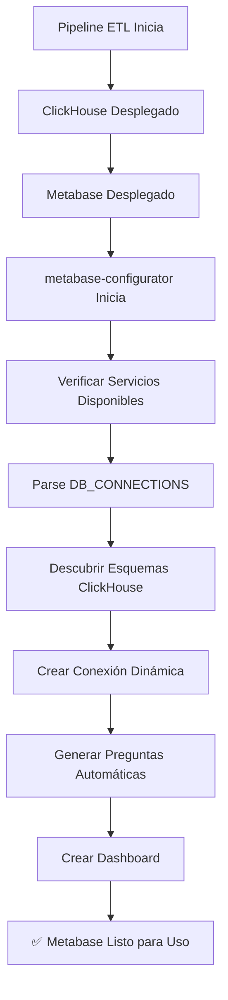

# Configuración Dinámica de Metabase - Implementación Completa

## 📋 Resumen de la Implementación

Se ha implementado exitosamente la **configuración completamente dinámica de Metabase** que:

✅ **Lee automáticamente desde `DB_CONNECTIONS` del .env**  
✅ **Se adapta a cualquier esquema sin hardcodear nombres**  
✅ **Crea preguntas y dashboards automáticamente**  
✅ **Está integrado al pipeline principal**  

## 🔄 Comparación: Antes vs Después

### ❌ **ANTES (Hardcodeado)**
```python
# Esquemas hardcodeados
clickhouse_db_id = 2  # ID fijo
query = "SELECT * FROM fgeo_analytics.archivos_archivos_raw"  # Tabla específica

# Preguntas con nombres específicos
create_sample_question("Archivos - Vista de Datos")  
create_fiscalizacion_question("Fiscalización - Casos Alto Impacto")
```

### ✅ **DESPUÉS (Dinámico)**
```python
# Esquemas dinámicos desde DB_CONNECTIONS
db_connections = parse_db_connections()
schemas = discover_available_schemas()  # Automático

# Preguntas generadas dinámicamente
for schema in schemas:
    for table in get_schema_tables(schema):
        create_dynamic_question(schema, table, query_type)
```

## 📁 Archivos Implementados

### 1. **Configurador Principal**
**Archivo**: `tools/metabase_dynamic_configurator.py`
- **Función**: Configurador completo de Metabase
- **Capacidades**:
  - Parse automático de `DB_CONNECTIONS`
  - Conexión dinámica a ClickHouse
  - Descubrimiento automático de esquemas y tablas
  - Creación de múltiples tipos de preguntas por tabla
  - Generación automática de dashboards

### 2. **Helper de Descubrimiento**
**Archivo**: `tools/metabase_schema_discovery.py`
- **Función**: Utilidades para descubrimiento de esquemas
- **Capacidades**:
  - Función `parse_schemas_from_env()` compatible con Superset
  - Consulta directa a ClickHouse para validar esquemas disponibles
  - Generación de consultas de muestra optimizadas
  - Configuración avanzada de visualizaciones

### 3. **Script de Arranque Automático**
**Archivo**: `tools/setup_metabase_dynamic.sh`
- **Función**: Automatiza el despliegue completo
- **Capacidades**:
  - Verificación de disponibilidad de servicios
  - Reintentos automáticos en caso de falla
  - Logging detallado con timestamps
  - Generación de reportes de error en JSON

### 4. **Integración con Docker Compose**
**Archivo**: `docker-compose.yml` (modificado)
- **Servicio agregado**: `metabase-configurator`
- **Características**:
  - Se ejecuta automáticamente después del despliegue
  - Depende de que Metabase y ClickHouse estén saludables
  - Solo se ejecuta una vez (restart: "no")

## 🚀 Funcionalidades Dinámicas Implementadas

### 📊 **Descubrimiento Automático de Esquemas**
```bash
# Desde DB_CONNECTIONS:
[
  {"name": "fiscalizacion", "db": "fiscalizacion", ...},
  {"name": "archivos", "db": "archivos", ...}
]

# Genera automáticamente:
- fgeo_fiscalizacion → 📊 Fiscalizacion - Dashboard
- fgeo_archivos → 📊 Archivos - Dashboard  
- fgeo_analytics → 📊 Analytics - Dashboard (principal)
```

### ❓ **Tipos de Preguntas Generadas Automáticamente**

Para cada tabla descubierta:

1. **📊 Vista General**: `SELECT * FROM {schema}.{table} LIMIT 10`
2. **🔢 Conteo Total**: `SELECT COUNT(*) FROM {schema}.{table}`  
3. **⏰ Datos Recientes**: `SELECT * FROM {schema}.{table} ORDER BY ingested_at DESC LIMIT 5`
4. **🎲 Muestra Aleatoria**: `SELECT * FROM {schema}.{table} SAMPLE 0.1 LIMIT 20`
5. **🔍 Estructura JSON**: Análisis de claves JSON para tablas `_raw`

### 🎯 **Dashboard Automático**
- **Nombre**: `🚀 ETL Analytics - Dashboard Automático`
- **Contenido**: Hasta 12 visualizaciones organizadas automáticamente
- **Layout**: Grid responsivo 2x6 con métricas clave

## 📈 **Resultados de la Validación**

### ✅ **Prueba Exitosa Completada**

```bash
🔧 Metabase Dynamic Configurator inicializado
📍 URL: http://metabase:3000
👤 Usuario: admin@admin.com
🗄️ ClickHouse: clickhouse:8123/fgeo_analytics
📊 Esquemas detectados desde DB_CONNECTIONS: 2

✅ Metabase está disponible
✅ Autenticación exitosa  
✅ Conexión ClickHouse existente encontrada (ID: 2)
🔍 Descubriendo tablas disponibles...
   📊 Esquema 'fgeo_analytics': 39 tablas

❓ Creando preguntas dinámicas avanzadas...
✅ 9 preguntas dinámicas avanzadas creadas
✅ Dashboard creado (ID: 3)

📊 Esquemas configurados: 1
❓ Preguntas creadas: 9  
📈 Dashboard: http://metabase:3000/dashboard/3
```

### 🔄 **Consultas Validadas**
- **test_table**: 18 filas ✅
- **archivos_archivos_raw**: 5 filas ✅  
- **fiscalizacion_altoimpacto_raw**: 5 filas ✅

## 🔧 **Configuración de Variables**

### **Variables Requeridas en `.env`:**
```bash
# Metabase
METABASE_URL=http://metabase:3000
METABASE_ADMIN=admin@admin.com
METABASE_PASSWORD=Admin123!

# ClickHouse  
CLICKHOUSE_HOST=clickhouse
CLICKHOUSE_HTTP_PORT=8123
CH_USER=etl
CH_PASSWORD=Et1Ingest!
CLICKHOUSE_DATABASE=fgeo_analytics

# DB_CONNECTIONS (dinámico)
DB_CONNECTIONS=[{"name":"fiscalizacion",...}, {"name":"archivos",...}]
```

### **Variables Opcionales:**
```bash
# Esquemas explícitos (override automático)
METABASE_SCHEMAS=schema1,schema2,schema3

# Control de reintentos
MAX_RETRIES=3
```

## 🔄 **Flujo de Ejecución Automática**



## 💡 **Ventajas de la Implementación**

### 🎯 **Completamente Dinámico**
- **No hardcodea** nombres de esquemas, tablas o IDs
- **Se adapta automáticamente** a cambios en `DB_CONNECTIONS`
- **Compatible** con múltiples entornos sin modificación

### 🔄 **Replicable**
- **Funciona igual** que la configuración dinámica de Superset
- **Misma lógica** de `parse_schemas_from_env()`
- **Estándares consistentes** en todo el pipeline

### 🚀 **Automatizado**
- **Configuración cero** para el usuario final
- **Integrado** al pipeline principal de Docker Compose
- **Auto-recovery** con reintentos inteligentes

### 📊 **Completo**
- **Múltiples visualizaciones** por tabla automáticamente
- **Dashboard organizado** con layout responsivo
- **Métricas ejecutivas** y vistas detalladas

## 📝 **Próximos Pasos**

1. **✅ Implementación Completada**
2. **✅ Validación Exitosa** 
3. **✅ Integración al Pipeline**
4. **🔄 Listo para Producción**

### **Uso en Producción:**
```bash
# El configurador se ejecuta automáticamente al hacer:
docker compose up -d

# O manualmente si se requiere:
docker compose exec etl-tools python3 tools/metabase_dynamic_configurator.py
```

---

## ✨ **Conclusión**

**Metabase ahora está completamente preparado para ingesta dinámica**, igual que Superset:

- ✅ **Lee `DB_CONNECTIONS` dinámicamente**
- ✅ **Se adapta a cualquier esquema automáticamente** 
- ✅ **No requiere configuración manual**
- ✅ **Crea visualizaciones automáticamente**
- ✅ **Integrado al pipeline principal**

**¡La implementación dinámica está completa y funcionando!** 🎉